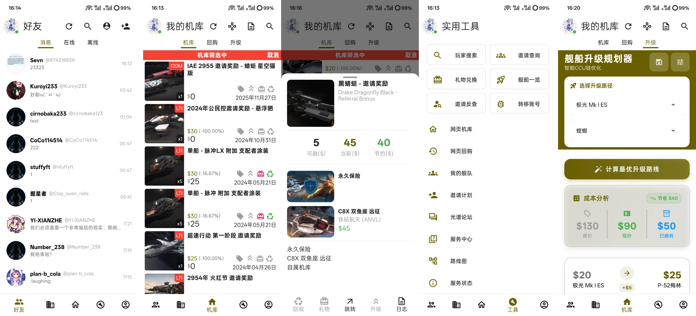

<div align="center">
  
  <h1>星河避难所</h1>
  <p><strong>Refuge Next</strong> — 星际公民第三方移动端助手</p>

  
  
  
  
</div>

---

## 应用预览

<div align="center">
  
</div>

## 简介

星河避难所是一款基于 Flutter 开发的星际公民（Star Citizen）第三方客户端，支持 Android、iOS 和 Windows 平台。帮助玩家在移动端便捷地管理账号、查看机库、浏览商店和使用各类实用工具。

## 功能特性

### 账号管理
- 登录 / 注册官网账号
- 多账号一键切换
- 光谱（Spectrum）账号一键切换
- 玩家个人信息展示

### 机库管理
- 机库物品完整展示（状态 / 价值 / 入库时间 / 保险时间）
- 自动堆叠与详细信息查看
- 快速查看机库总价值 / 消费额 / 邀请点数
- 一键回收 / 赠送 / 取消赠送
- 回购信息展示与管理
- 舰船升级规划

### 商店功能
- 官网商店物品浏览与筛选
- 一键购买（自动添加信用点）
- 批量购买支持
- 商店信息中文汉化

### 游戏工具
- 一键重置玩家角色（无视官网时间限制）
- 一键拷贝 / 重置 PTU 账号
- 官网玩家查询
- 舰船 / 组件信息查询
- 一键进入舰队页面

### 其他特性
- 教程查看
- 离线缓存
- 语言切换
- 主题切换

## 快速开始

### 环境要求

- Flutter SDK >= 3.4.3
- Dart SDK >= 3.4.3

### 安装与运行

```bash
# 安装依赖
flutter pub get

# 生成代码（Freezed / JSON Serializable）
flutter packages pub run build_runner build --delete-conflicting-outputs

# 运行应用
flutter run
```

### 构建发布版本

```bash
# Android
flutter build apk

# iOS
flutter build ios

# Windows
flutter build windows
```

## 联系方式

如有问题或建议，欢迎通过 QQ 群: 689970313交流反馈。